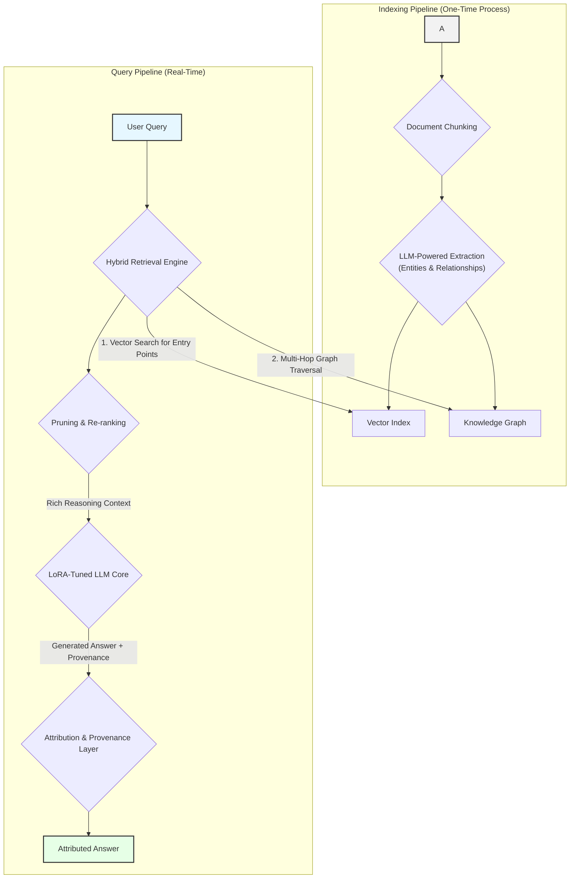

# VeritasGraph  
**Enterprise-Grade Graph RAG for Secure, On-Premise AI with Verifiable Attribution**
 


VeritasGraph is a production-ready, end-to-end framework for building advanced question-answering and summarization systems that operate entirely within your private infrastructure.  

It is architected to overcome the fundamental limitations of traditional vector-search-based Retrieval-Augmented Generation (RAG) by leveraging a knowledge graph to perform complex, multi-hop reasoning.  

Baseline RAG systems excel at finding direct answers but falter when faced with questions that require connecting disparate information or understanding a topic holistically. **VeritasGraph addresses this challenge directly, providing not just answers, but transparent, auditable reasoning paths with full source attribution for every generated claim, establishing a new standard for trust and reliability in enterprise AI.**
<p align="center"> 


 

<a href="https://linkedin.com/in/bibin-prathap-4a34a489/">

</a>

</p>

**[➡️⚡️ Live documentation](https://bibinprathap.github.io/VeritasGraph/index.html)**

**[📖 Article](https://medium.com/@bibinprathap/beyond-vector-search-building-trustworthy-enterprise-ai-with-the-veritasgraph-rag-pipeline-53fc8e9e8ff9)**

**[📄 Research Paper](VeritasGraph%20-%20A%20Sovereign%20GraphRAG%20Framework%20for%20Enterprise-Grade%20AI%20with%20Verifiable%20Attribution.pdf)**

**[🎮 Try Live Demo](https://bibinprathap.github.io/VeritasGraph/demo/)** - *Stable URL - always redirects to current server*

 
---
## Why VeritasGraph?

### ✅ Fully On-Premise & Secure
Maintain **100% control** over your data and AI models, ensuring maximum security and privacy.

### ✅ Verifiable Attribution
Every generated claim is **traced back** to its source document, guaranteeing transparency and accountability.

### ✅ Advanced Graph Reasoning
Answer **complex, multi-hop questions** that go beyond the capabilities of traditional vector search engines.

### ✅ Interactive Graph Visualization
Explore your knowledge graph with an **interactive 2D graph explorer** powered by PyVis, showing entities, relationships, and reasoning paths in real-time.

### ✅ Open-Source & Sovereign
Build a **sovereign knowledge asset**, free from vendor lock-in, with full ownership and customization.

## 🚀 Demo  

### Video Walkthrough  
A brief video demonstrating the core functionality of VeritasGraph, from data ingestion to multi-hop querying with full source attribution.  
## Windows
[](https://drive.google.com/file/d/1lEmAOUCLV0h98kY-ars96SNf5O6lVmiY/view?usp=sharing)  
## Linux
[](https://drive.google.com/file/d/1OmeCj9-HKTCDoznPDE8u7Bbb3qxYBs9n/view?usp=sharing)  
 
---

### System Architecture Screenshot  
The following diagram illustrates the end-to-end pipeline of the VeritasGraph system:  
 


 
---
## Five-Minute Magic Onboarding (Docker)

Clone the repo and run a full VeritasGraph stack (Ollama + Neo4j + Gradio app) with one command:

1. Update `docker/five-minute-magic-onboarding/.env` with your Neo4j password (defaults for the rest).
2. From the same folder run:
    ```bash
    cd docker/five-minute-magic-onboarding
    docker compose up --build
    ```
3. Services exposed:
    - Gradio UI: http://127.0.0.1:7860/
    - Neo4j Browser: http://localhost:7474/
    - Ollama API: http://localhost:11434/

See `docker/five-minute-magic-onboarding/README.md` for deeper details.

---

## 🌐 Free Cloud Deployment (Share with Developers)

Share VeritasGraph with your team using these **free** deployment options:

### Option 1: Gradio Share Link (Easiest - 72 hours)

Run with the `--share` flag to get a public URL instantly:

```bash
cd graphrag-ollama-config
python app.py --share
```

This creates a temporary public URL like `https://xxxxx.gradio.live` that works for **72 hours**. Perfect for quick demos!

### Option 2: Ngrok (Persistent Local Tunnel)

Keep Ollama running locally while exposing the UI to the internet:

1. **Install ngrok:** https://ngrok.com/download (free account required)

2. **Start your app locally:**
   ```bash
   cd graphrag-ollama-config
   python app.py --host 0.0.0.0 --port 7861
   ```

3. **In another terminal, create the tunnel:**
   ```bash
   ngrok http 7861
   ```

4. **Share the ngrok URL** (e.g., `https://abc123.ngrok.io`) with developers.

### Option 3: Cloudflare Tunnel (Free, No Account Required)

```bash
# Install cloudflared
# Windows: winget install cloudflare.cloudflared
# Mac: brew install cloudflared
# Linux: https://developers.cloudflare.com/cloudflare-one/connections/connect-apps/install-and-setup/

# Start the tunnel
cloudflared tunnel --url http://localhost:7861
```

### Option 4: Hugging Face Spaces (Permanent Free Hosting)

For a permanent demo (without local Ollama), deploy to Hugging Face Spaces:

1. Create a new Space at https://huggingface.co/spaces
2. Choose "Gradio" as the SDK
3. Upload your `graphrag-ollama-config` folder
4. Set environment variables in Space settings (use OpenAI/Groq API instead of Ollama)

### Comparison Table

| Method | Duration | Local Ollama | Setup Time | Best For |
|--------|----------|--------------|------------|----------|
| `--share` | 72 hours | ✅ Yes | 1 min | Quick demos |
| Ngrok | Unlimited* | ✅ Yes | 5 min | Team evaluation |
| Cloudflare | Unlimited* | ✅ Yes | 5 min | Team evaluation |
| HF Spaces | Permanent | ❌ No (use cloud LLM) | 15 min | Public showcase |

*Free tier has some limitations

---

## OpenAI-Compatible API Support

VeritasGraph supports **any OpenAI-compatible API**, making it easy to use with various LLM providers:

| Provider | Type | Notes |
|----------|------|-------|
| **OpenAI** | Cloud | Native API support |
| **Azure OpenAI** | Cloud | Full Azure integration |
| **Groq** | Cloud | Ultra-fast inference |
| **Together AI** | Cloud | Open-source models |
| **OpenRouter** | Cloud | Multi-provider routing |
| **Anyscale** | Cloud | Scalable endpoints |
| **LM Studio** | Local | Easy local deployment |
| **LocalAI** | Local | Docker-friendly |
| **vLLM** | Local/Server | High-performance serving |
| **Ollama** | Local | Default setup |

### Quick Setup

1. **Copy the configuration files:**
   ```bash
   cd graphrag-ollama-config
   cp settings_openai.yaml settings.yaml
   cp .env.openai.example .env
   ```

2. **Edit `.env` with your provider settings:**
   ```env
   # Example: OpenAI
   GRAPHRAG_API_KEY=sk-your-openai-api-key
   GRAPHRAG_LLM_MODEL=gpt-4-turbo-preview
   GRAPHRAG_LLM_API_BASE=https://api.openai.com/v1
   GRAPHRAG_EMBEDDING_MODEL=text-embedding-3-small
   GRAPHRAG_EMBEDDING_API_BASE=https://api.openai.com/v1
   ```

3. **Run GraphRAG:**
   ```bash
   python -m graphrag.index --root . --config settings_openai.yaml
   python app.py
   ```

### Hybrid Configurations

Mix different providers for LLM and embeddings (e.g., Groq for fast LLM + local Ollama for embeddings):

```env
GRAPHRAG_API_KEY=gsk_your-groq-key
GRAPHRAG_LLM_MODEL=llama-3.1-70b-versatile
GRAPHRAG_LLM_API_BASE=https://api.groq.com/openai/v1
GRAPHRAG_EMBEDDING_API_KEY=ollama
GRAPHRAG_EMBEDDING_MODEL=nomic-embed-text
GRAPHRAG_EMBEDDING_API_BASE=http://localhost:11434/v1
```

📖 **Full documentation:** See [OPENAI_COMPATIBLE_API.md](graphrag-ollama-config/OPENAI_COMPATIBLE_API.md) for detailed provider configurations, environment variables reference, and troubleshooting.

---

## Switching Between Ollama and OpenAI-Compatible APIs

You can easily switch between different LLM providers by editing your `.env` file. Here are the most common configurations:

### Option 1: Full Ollama (100% Local/Private)
```env
# LLM - Ollama
GRAPHRAG_API_KEY=ollama
GRAPHRAG_LLM_MODEL=llama3.1-12k
GRAPHRAG_LLM_API_BASE=http://localhost:11434/v1

# Embeddings - Ollama
GRAPHRAG_EMBEDDING_MODEL=nomic-embed-text
GRAPHRAG_EMBEDDING_API_BASE=http://localhost:11434/v1
GRAPHRAG_EMBEDDING_API_KEY=ollama
```

### Option 2: Full OpenAI (Cloud)
```env
# LLM - OpenAI
GRAPHRAG_API_KEY=sk-proj-your-key
GRAPHRAG_LLM_MODEL=gpt-4-turbo-preview
GRAPHRAG_LLM_API_BASE=https://api.openai.com/v1

# Embeddings - OpenAI
GRAPHRAG_EMBEDDING_MODEL=text-embedding-3-small
GRAPHRAG_EMBEDDING_API_BASE=https://api.openai.com/v1
GRAPHRAG_EMBEDDING_API_KEY=sk-proj-your-key
```

### Option 3: Hybrid (OpenAI LLM + Ollama Embeddings)
Best of both worlds - powerful cloud LLM with local embeddings for privacy:
```env
# LLM - OpenAI
GRAPHRAG_API_KEY=sk-proj-your-key
GRAPHRAG_LLM_MODEL=gpt-4-turbo-preview
GRAPHRAG_LLM_API_BASE=https://api.openai.com/v1

# Embeddings - Ollama (local)
GRAPHRAG_EMBEDDING_MODEL=nomic-embed-text
GRAPHRAG_EMBEDDING_API_BASE=http://localhost:11434/v1
GRAPHRAG_EMBEDDING_API_KEY=ollama
```

### Quick Reference

| Provider | API Base | API Key | Example Model |
|----------|----------|---------|---------------|
| **Ollama** | `http://localhost:11434/v1` | `ollama` | `llama3.1-12k` |
| **OpenAI** | `https://api.openai.com/v1` | `sk-proj-...` | `gpt-4-turbo-preview` |
| **Groq** | `https://api.groq.com/openai/v1` | `gsk_...` | `llama-3.1-70b-versatile` |
| **Together AI** | `https://api.together.xyz/v1` | your-key | `meta-llama/Meta-Llama-3.1-70B-Instruct-Turbo` |
| **LM Studio** | `http://localhost:1234/v1` | `lm-studio` | (model loaded in LM Studio) |

> ⚠️ **Important:** Embeddings must match your index! If you indexed with `nomic-embed-text` (768 dimensions), you must query with the same model. Switching embedding models requires **re-indexing** your documents.

---
# Guide to build graphrag with local LLM
 

 
## Environment
I'm using Ollama ( llama3.1) on Windows / Linux and  Ollama (nomic-text-embed) for text embeddings
 
Please don't use WSL if you use LM studio for embeddings because it will have issues connecting to the services on Windows (LM studio)
 
### IMPORTANT! Fix your model context length in Ollama
 
Ollama's default context length is 2048, which might truncate the input and output when indexing
 
I'm using 12k context here (10*1024=12288), I tried using 10k before, but the results still gets truncated
 
**Input / Output truncated might get you a completely out of context report in local search!!**
 
Note that if you change the model in `setttings.yaml` and try to reindex, it will restart the whole indexing!
 
First, pull the models we need to use
 
```
ollama serve
# in another terminal
ollama pull llama3.1
ollama pull nomic-embed-text
```
 
Then build the model with the `Modelfile` in this repo
```
ollama create llama3.1-12k -f ./Modelfile
```
 
## Steps for GraphRAG Indexing
First, activate the conda enviroment
```
conda create -n rag python=<any version below 3.12>
conda activate rag
```
 
Clone this project then cd the directory
```
cd graphrag-ollama-config
```
 
Then pull the code of graphrag (I'm using a local fix for graphrag here) and install the package
```
cd graphrag-ollama
pip install -e ./
 
```
 
You can skip this step if you used this repo, but this is for initializing the graphrag folder
```
pip install sympy
pip install future
pip install ollama
python -m graphrag.index --init --root .
```
 
Create your `.env` file
```
cp .env.example .env
```
 
Move your input text to `./input/`
 
Double check the parameters in `.env` and `settings.yaml`, make sure in `setting.yaml`,
it should be "community_reports" instead of "community_report"
 
Then finetune the prompts (this is important, this will generate a much better result)
 
You can find more about how to tune prompts [here](https://microsoft.github.io/graphrag/posts/prompt_tuning/auto_prompt_tuning/)
```
python -m graphrag.prompt_tune --root . --domain "Christmas" --method random --limit 20 --language English --max-tokens 2048 --chunk-size 256  --no-entity-types --output ./prompts
```
 
Then you can start the indexing
```
python -m graphrag.index --root .
```
 
You can check the logs in `./output/<timestamp>/reports/indexing-engine.log` for errors
 
Test a global query
```
python -m graphrag.query \
--root . \
--method global \
"What are the top themes in this story?"
```
 
## Using the UI
 
First, make sure requirements are installed
```
pip install -r requirements.txt
```
 
Then run the app using
```
gradio app.py
```
 
To use the app, visit http://127.0.0.1:7860/

---

## 🔗 Interactive Graph Visualization

VeritasGraph includes an **interactive 2D knowledge graph explorer** that visualizes entities and relationships in real-time!

### Graph Explorer Tab

*Interactive knowledge graph showing entities, communities, and relationships*

### Chat with Graph Context

*Query responses with full source attribution and graph visualization*

### Features
| Feature | Description |
|---------|-------------|
| **Query-aware subgraph** | Shows only entities related to your query |
| **Community coloring** | Nodes grouped by community membership |
| **Red highlight** | Query-related entities shown in red |
| **Node sizing** | Bigger nodes = more connections |
| **Interactive** | Drag, zoom, hover for entity details |
| **Full graph explorer** | View entire knowledge graph |

### How It Works
1. After each query, the system extracts the relevant subgraph (nodes/edges) used for reasoning
2. PyVis generates an interactive HTML visualization
3. Switch to the **🔗 Graph Explorer** tab to see the visualization
4. Click **"Explore Full Graph"** to view the entire knowledge graph

### Toggle Visualization
Use the checkbox **"🔗 Show Graph Visualization"** in the left panel to enable/disable automatic graph updates after each query.
 
## 📑 Table of Contents  

- [Core Capabilities](#1-core-capabilities)  
- [The Architectural Blueprint](#2-the-architectural-blueprint-from-unstructured-data-to-attributed-insights)  
- [Beyond Semantic Search](#3-beyond-semantic-search-solving-the-multi-hop-challenge)  
- [Secure On-Premise Deployment Guide](#4-secure-on-premise-deployment-guide)  
- [API Usage & Examples](#5-api-usage--examples)  
- [Project Philosophy & Future Roadmap](#6-project-philosophy--future-roadmap)  
- [Acknowledgments & Citations](#7-acknowledgments--citations)  

---

## 1. Core Capabilities  

VeritasGraph integrates four critical components into a cohesive, powerful, and secure system:  

- **Multi-Hop Graph Reasoning** – Move beyond semantic similarity to traverse complex relationships within your data.  
- **Efficient LoRA-Tuned LLM** – Fine-tuned using Low-Rank Adaptation for efficient, powerful on-premise deployment.  
- **End-to-End Source Attribution** – Every statement is linked back to specific source documents and reasoning paths.  
- **Secure & Private On-Premise Architecture** – Fully deployable within your infrastructure, ensuring data sovereignty.  

---

## 2. The Architectural Blueprint: From Unstructured Data to Attributed Insights  

The VeritasGraph pipeline transforms unstructured documents into a structured knowledge graph for attributable reasoning.  

### **Stage 1: Automated Knowledge Graph Construction**  
- **Document Chunking** – Segment input docs into granular `TextUnits`.  
- **Entity & Relationship Extraction** – LLM extracts structured triplets `(head, relation, tail)`.  
- **Graph Assembly** – Nodes + edges stored in a graph database (e.g., Neo4j).  

### **Stage 2: The Hybrid Retrieval Engine**  
- **Query Analysis & Entry-Point Identification** – Vector search finds relevant entry nodes.  
- **Contextual Expansion via Multi-Hop Traversal** – Graph traversal uncovers hidden relationships.  
- **Pruning & Re-Ranking** – Removes noise, keeps most relevant facts for reasoning.  

### **Stage 3: The LoRA-Tuned Reasoning Core**  
- **Augmented Prompting** – Context formatted with query, sources, and instructions.  
- **LLM Generation** – Locally hosted, LoRA-tuned open-source model generates attributed answers.  
- **LoRA Fine-Tuning** – Specialization for reasoning + attribution with efficiency.  

### **Stage 4: The Attribution & Provenance Layer**  
- **Metadata Propagation** – Track source IDs, chunks, and graph nodes.  
- **Traceable Generation** – Model explicitly cites sources.  
- **Structured Attribution Output** – JSON object with provenance + reasoning trail.  

---

## 3. Beyond Semantic Search: Solving the Multi-Hop Challenge  

Traditional RAG fails at complex reasoning (e.g., linking an engineer across projects and patents).  
VeritasGraph succeeds by combining:  

- **Semantic search** → finds entry points.  
- **Graph traversal** → connects the dots.  
- **LLM reasoning** → synthesizes final answer with citations.  

---

## 4. Secure On-Premise Deployment Guide  

### **Prerequisites**  

**Hardware**  
- CPU: 16+ cores  
- RAM: 64GB+ (128GB recommended)  
- GPU: NVIDIA GPU with 24GB+ VRAM (A100, H100, RTX 4090)  

**Software**  
- Docker & Docker Compose  
- Python 3.10+  
- NVIDIA Container Toolkit  

### **Configuration**  
- Copy `.env.example` → `.env`  
- Populate with environment-specific values  

## 6. Project Philosophy & Future Roadmap
### **Philosophy**  

VeritasGraph is founded on the principle that the most powerful AI systems should also be the most transparent, secure, and controllable.

The project's philosophy is a commitment to democratizing enterprise-grade AI, providing organizations with the tools to build their own sovereign knowledge assets.

This stands in contrast to reliance on opaque, proprietary, cloud-based APIs, empowering organizations to maintain full control over their data and reasoning processes.

### **Roadmap**  

**Planned future enhancements include:**

- Expanded Database Support – Integration with more graph databases and vector stores.

- Advanced Graph Analytics – Community detection and summarization for holistic dataset insights (inspired by Microsoft’s GraphRAG).

- Agentic Framework – Multi-step reasoning tasks, breaking down complex queries into sub-queries.

- Visualization UI – A web interface for graph exploration and attribution path inspection.

## 🏆 Awards & Recognition

VeritasGraph has been recognized for its contribution to the field of AI and Knowledge Graphs.

### ICASF 2025
Presented at the **International Conference on Applied Science and Future Technology (ICASF 2025)**.


**[📄 View Appreciation Certificate](ICASF%202025%20-%20Appreciation%20Certificate.pdf)**

## 📚 Citation

If you use VeritasGraph in your research, please cite our paper:

**[VeritasGraph: A Sovereign GraphRAG Framework for Enterprise-Grade AI with Verifiable Attribution](VeritasGraph%20-%20A%20Sovereign%20GraphRAG%20Framework%20for%20Enterprise-Grade%20AI%20with%20Verifiable%20Attribution.pdf)**

```bibtex
@article{VeritasGraph2025,
  title={VeritasGraph: A Sovereign GraphRAG Framework for Enterprise-Grade AI with Verifiable Attribution},
  author={Bibin Prathap},
  journal={International Conference on Applied Science and Future Technology (ICASF)},
  year={2025}
}
```

## 7. Acknowledgments & Citations

This project builds upon the foundational research and open-source contributions of the AI community.

We acknowledge the influence of the following works:

- HopRAG – pioneering research on graph-structured RAG and multi-hop reasoning.

- Microsoft GraphRAG – comprehensive approach to knowledge graph extraction and community-based reasoning.

- LangChain & LlamaIndex – robust ecosystems that accelerate modular RAG system development.

- Neo4j – foundational graph database technology enabling scalable Graph RAG implementations.

 
## Star History
 
[](https://www.star-history.com/#bibinprathap/VeritasGraph&Date)


  
